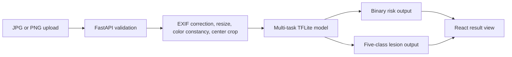
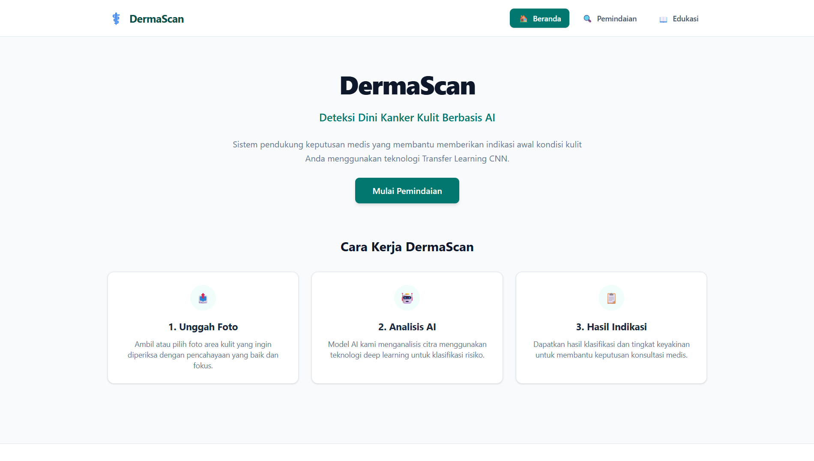
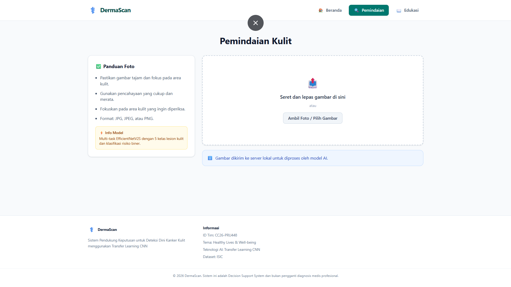
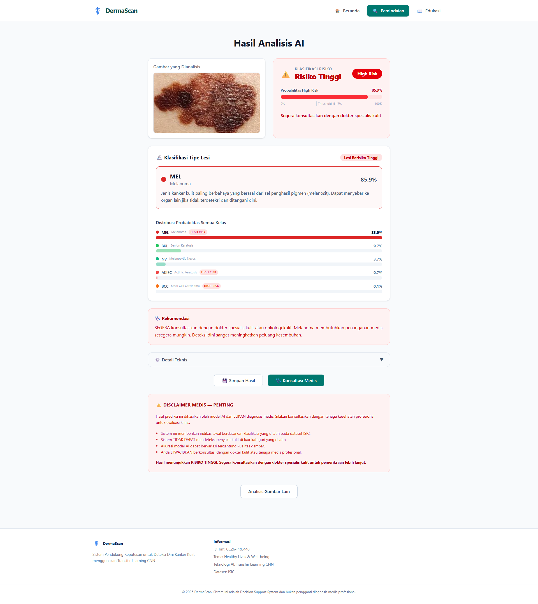

# DermaScan

[](https://www.tensorflow.org/)
[](https://fastapi.tiangolo.com/)
[](https://react.dev/)

Educational skin-lesion decision-support prototype using a multi-task TensorFlow model, a FastAPI inference service, and a React interface.

> This repository is a fork of [`finSpy03/DermaScan_Project`](https://github.com/finSpy03/DermaScan_Project) and represents work from Capstone Team **CC26-PRU448** for Coding Camp 2026 powered by DBS Foundation.

- **Web application:** [dermascan-azure.vercel.app](https://dermascan-azure.vercel.app/)
- **API health:** [dermascanproject-production.up.railway.app/api/health](https://dermascanproject-production.up.railway.app/api/health)

## Purpose

DermaScan accepts a skin-lesion image and returns two model outputs:

- a binary **Low Risk / High Risk** recommendation;
- a five-class lesion prediction across `AKIEC`, `BCC`, `BKL`, `MEL`, and `NV`.

The result is accompanied by class probabilities, educational information, and a medical disclaimer. It is not a certified medical device and must not be used as a substitute for professional diagnosis.

## Implemented workflow



The backend prefers `dermascan_model.tflite` and falls back to the saved Keras model when required. The preprocessing configuration specifies a 320-pixel resize followed by a 300×300 crop/pad and Shades of Gray color constancy.

## Features

- Multipart image upload with format and size validation.
- EXIF orientation correction and memory-conscious Pillow draft decoding.
- Shades of Gray color-constancy preprocessing.
- Multi-task inference with binary and five-class outputs.
- Risk gauge, class-probability display, lesion information, and disclaimer in the React UI.
- FastAPI health and prediction endpoints with configured CORS origins.
- Vercel frontend and Railway backend deployment configuration.

## Model artifacts

The repository includes:

- `dermascan_multitask_high_low.keras` — saved Keras model with custom attention/calibration layers;
- `dermascan_model.tflite` — TensorFlow Lite conversion used by the deployed backend;
- JSON mappings and preprocessing configuration used at inference time.

The TFLite file is smaller than the Keras artifact, but the checked-in conversion evidence does not establish post-training quantization. The project therefore describes it as a TFLite conversion, not a quantized model.

Training data, a reproducible training notebook, and independent clinical validation are not included in this fork. No diagnostic-accuracy claim is made here.

## Technology

| Layer | Main tools |
| --- | --- |
| Model runtime | TensorFlow, Keras, TensorFlow Lite, NumPy, Pillow |
| API | Python, FastAPI, Uvicorn, Pydantic |
| Web client | React 18, Vite, JavaScript, CSS, Lucide |
| Hosting | Railway, Vercel, Nixpacks/Procfile |

## Repository map

```text
backend/
  app.py                    FastAPI routes, upload validation, and CORS
  inference.py              preprocessing, custom layers, model loading, inference
  lesion_info.py            educational lesion information
  production-models/        Keras/TFLite artifacts and JSON configuration
frontend/
  src/components/           upload, result, header, and education components
  src/services/api.js       backend request wrapper
docs/screenshots/           authentic application screenshots
```

## Local setup

### Backend

```bash
cd backend
python -m venv .venv
```

Activate the environment, then run:

```bash
python -m pip install -r requirements.txt
uvicorn app:app --reload --host 127.0.0.1 --port 8000
```

The model files under `backend/production-models/` are required. API documentation is available at `http://127.0.0.1:8000/docs`.

### Frontend

```bash
cd frontend
npm install
```

Copy `frontend/.env.example` to `frontend/.env` and set:

```env
VITE_API_URL=http://127.0.0.1:8000
```

Then start Vite:

```bash
npm run dev
```

## Screenshots

| Landing page | Upload flow | Prediction result |
| --- | --- | --- |
|  |  |  |

## Team and contribution context

The project was developed collaboratively by Team CC26-PRU448. Repository history includes work from Raihan Hadriansyah, Muhammad Fahmi Hadyan Haq, and Eka Safari; additional non-code responsibilities are documented by the team.

My documented contribution covers TFLite model conversion, FastAPI integration, Railway/Vercel deployment work, and full-stack integration. It does not claim sole ownership of the model, dataset work, or React interface.

## Status and limitations

Capstone team prototype with working deployment endpoints. Important limitations:

- educational decision support only, not clinical diagnosis;
- no independent clinical validation or regulatory certification;
- no reproducible training pipeline or evaluation report in this fork;
- no automated backend/frontend test suite is currently included;
- deployment availability can change outside the repository.

## License

Licensed under the [MIT License](LICENSE). See the upstream repository and commit history for attribution.
