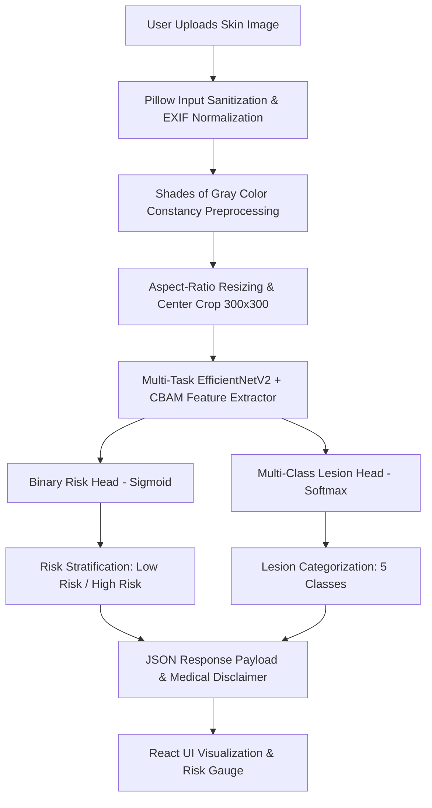
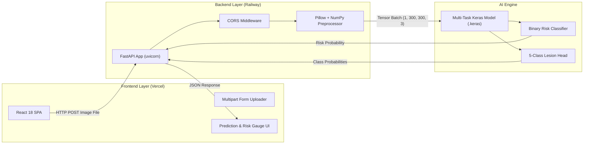

# 🩸 DermaScan — AI-Powered Skin Lesion Risk Classification & Analysis

[](https://www.python.org/)
[](https://www.tensorflow.org/)
[](https://fastapi.tiangolo.com/)
[](https://reactjs.org/)
[](https://developer.mozilla.org/en-US/docs/Web/JavaScript)
[](https://opensource.org/licenses/MIT)

> **DermaScan** is an end-to-end medical AI application that utilizes multi-task deep neural networks and computer vision to analyze skin lesions, compute risk stratification scores, classify specific lesion categories, and deliver educational medical insights.

🌐 **Live Web Application**: [https://dermascan-azure.vercel.app/](https://dermascan-azure.vercel.app/)

---

## 📌 Executive Summary

Early detection of malignant skin lesions (such as Melanoma and Basal Cell Carcinoma) dramatically improves clinical outcomes. **DermaScan** bridges advanced deep learning computer vision with accessible web technology, providing users and healthcare practitioners with rapid, automated skin lesion analysis.

The system features a **Multi-Task EfficientNetV2 Architecture** enhanced with **Convolutional Block Attention Modules (CBAM)** and **Feature Calibration Layers**. It simultaneously performs:
1. **Binary Risk Stratification**: Classifying lesions into *Low Risk* vs. *High Risk*.
2. **Multi-Class Categorization**: Predicting specific diagnostic lesion types across 5 primary clinical categories.

---

## ✨ Key Features

✔ **Multi-Task Deep Learning**: Dual-head architecture predicting both binary risk levels and multi-class lesion taxonomy in a single forward pass.  
✔ **Attention-Enhanced Feature Extraction**: Incorporates spatial and channel attention (CBAM) to focus on clinically relevant lesion boundaries.  
✔ **Ultra-Low Memory TFLite Inference**: Converted Keras backbone into an optimized TensorFlow Lite (`.tflite`) flatbuffer model, reducing server RAM usage to **<50 MB** with sub-200ms latency.  
✔ **Color Constancy Preprocessing**: Utilizes Shades of Gray algorithm (power=6) to normalize lighting variances and skin tone differences across capture devices.  
✔ **Pillow Draft Downscaling**: Handles high-resolution camera uploads without memory spikes or server OOM errors.  
✔ **Interactive Confidence Visualization**: Dynamic risk gauge and class probability distribution breakdowns.  
✔ **Integrated Medical Education**: Interactive guidance on skin lesion types, self-examination protocols, and clinical disclaimers.  
✔ **Production-Ready REST API**: Fully validated OpenAPI/FastAPI endpoints with CORS configuration, health checks, and error handling.  

---

## 🚀 Live Demo & Deployment

| Component | Platform | Status | URL |
| :--- | :--- | :--- | :--- |
| **Frontend Web App** | Vercel |  | [dermascan-azure.vercel.app](https://dermascan-azure.vercel.app/) |
| **Backend Inference API** | Railway |  | `https://dermascanproject-production.up.railway.app` |

---

## 🛠️ Technology Stack

| Layer | Technologies & Frameworks |
| :--- | :--- |
| **Deep Learning & CV** | TensorFlow 2.x, TensorFlow Lite (TFLite), Keras, EfficientNetV2, CBAM Attention, NumPy, Pillow |
| **Backend REST API** | Python 3.10+, FastAPI, Uvicorn, Pydantic, Python-Multipart |
| **Frontend UI** | React 18, Vite, Vanilla CSS Design System, Lucide Icons |
| **DevOps & Cloud** | Nixpacks, Docker-compatible Procfile, Vercel, Railway |

---

## 🧠 AI Inference Pipeline



---

## 🏗️ System Architecture



---

## 📁 Project Structure

```text
DermaScan_Project/
├── LICENSE                          # MIT License
├── README.md                        # Main Project Documentation
├── .gitignore                       # Git exclusion rules
├── backend/                         # FastAPI Backend Microservice
│   ├── README.md                    # Backend Documentation
│   ├── app.py                       # FastAPI Application Entrypoint & Routes
│   ├── inference.py                 # Keras Model Loader & Inference Engine
│   ├── lesion_info.py               # Medical Lesion Knowledgebase
│   ├── Procfile                     # Railway Deployment Start Command
│   ├── nixpacks.toml                # Railway Buildpack Configuration
│   ├── requirements.txt             # Python Dependencies
│   └── production-models/           # AI Model Artifacts & Preprocessing Metadata
│       ├── README.md                # Model & Weight Documentation
│       ├── dermascan_multitask_high_low.keras  # Saved Multi-Task Keras Model (89.8 MB)
│       ├── preprocessing_config.json # Pipeline Preprocessing Parameters
│       ├── index_to_label.json      # Index-to-Lesion Mapping
│       ├── index_to_risk.json       # Index-to-Risk Mapping
│       ├── label_to_index.json      # Lesion-to-Index Mapping
│       └── risk_to_index.json       # Risk-to-Index Mapping
└── frontend/                        # React Frontend Web Application
    ├── README.md                    # Frontend Documentation
    ├── package.json                 # Node.js Dependencies & Scripts
    ├── vite.config.js               # Vite Configuration
    ├── index.html                   # HTML Entrypoint
    ├── .env.example                 # Environment Variable Template
    └── src/                         # Application Source Code
        ├── main.jsx                 # React DOM Root
        ├── App.jsx                  # Main Application Component
        ├── index.css                # Design System & Custom CSS Tokens
        ├── components/              # Modular UI Components
        │   ├── Header.jsx           # App Navigation Bar
        │   ├── ImageUploader.jsx    # Drag-and-Drop File Upload
        │   ├── PredictionResult.jsx # AI Diagnostic Results Display
        │   └── EducationCard.jsx    # Medical Information Card
        └── services/                # API Integration Layer
            └── api.js               # Backend Fetch Wrapper
```

---

## ⚙️ Installation & Setup Guide

### Prerequisites
- **Python**: `3.10` or higher
- **Node.js**: `18.x` or higher (`npm` package manager)
- **Git**: `2.x`

---

### 1. Clone Repository
```bash
git clone https://github.com/RaihanHadriansyah21/DermaScan_Project.git
cd DermaScan_Project
```

---

### 2. Backend Setup
```bash
# Navigate to backend directory
cd backend

# Create Python virtual environment
python -m venv venv

# Activate virtual environment
# Windows (PowerShell):
.\venv\Scripts\Activate.ps1
# Linux/macOS:
source venv/bin/activate

# Install dependencies
pip install -r requirements.txt

# Start backend dev server
uvicorn app:app --reload --host 0.0.0.0 --port 8000
```
Backend server will start at: `http://localhost:8000`  
Interactive API Docs (Swagger): `http://localhost:8000/docs`

---

### 3. Frontend Setup
```bash
# Navigate to frontend directory (from root)
cd frontend

# Install Node.js dependencies
npm install

# Configure local environment variables
cp .env.example .env
```
Edit `.env` for local development:
```env
VITE_API_URL=http://localhost:8000
```

Start Vite dev server:
```bash
npm run dev
```
Frontend application will be accessible at: `http://localhost:5173`

---

## 🔬 Model Architecture & Training Details

DermaScan utilizes a custom **Multi-Task Transfer Learning Network**:

- **Backbone**: EfficientNetV2 pre-trained on ImageNet.
- **Attention Modules**: Integrated **CBAM (Convolutional Block Attention Module)** featuring dual channel and spatial attention mechanisms.
- **Feature Calibration**: SE-style gating layer after global pooling to re-calibrate feature activations.
- **Dual Output Heads**:
  - `risk_output`: Sigmoid dense head for binary risk stratification (*Low Risk* vs. *High Risk*).
  - `lesion_output`: Softmax dense head across 5 lesion categories (*AKIEC*, *BCC*, *BKL*, *MEL*, *NV*).

### Lesion Taxonomy
| Abbreviation | Full Clinical Name | Risk Category |
| :--- | :--- | :--- |
| **AKIEC** | Actinic Keratosis / Intraepithelial Carcinoma | High Risk |
| **BCC** | Basal Cell Carcinoma | High Risk |
| **MEL** | Melanoma | High Risk |
| **BKL** | Benign Keratosis (Seborrheic Keratosis / Solar Lentigo) | Low Risk |
| **NV** | Melanocytic Nevus (Common Mole) | Low Risk |

---

## 📡 REST API Overview

### 1. Health Check
`GET /api/health`

**Response (`200 OK`)**:
```json
{
  "status": "healthy",
  "model_loaded": true
}
```

---

### 2. Predict Skin Lesion
`POST /api/predict`

**Request**: `multipart/form-data` with `file` (JPG, JPEG, PNG).

**cURL Example**:
```bash
curl -X POST "https://dermascanproject-production.up.railway.app/api/predict" \
     -H "accept: application/json" \
     -H "Content-Type: multipart/form-data" \
     -F "file=@skin_sample.jpg"
```

**Response (`200 OK`)**:
```json
{
  "risk_label": "High Risk",
  "risk_probability": 0.8924,
  "risk_threshold": 0.55,
  "lesion_label": "MEL",
  "lesion_probability": 0.8412,
  "lesion_probabilities": {
    "AKIEC": 0.0211,
    "BCC": 0.0413,
    "BKL": 0.0152,
    "MEL": 0.8412,
    "NV": 0.0812
  },
  "is_high_risk_lesion": true,
  "ensemble_size": 1,
  "tta_enabled": false,
  "lesion_info": {
    "name": "Melanoma (MEL)",
    "description": "Tipe kanker kulit yang paling berbahaya...",
    "recommendation": "Sangat disarankan untuk segera melakukan konsultasi dengan dokter spesialis kulit."
  },
  "disclaimer": "Hasil prediksi ini dihasilkan oleh model AI dan BUKAN diagnosis medis..."
}
```

---

## 🖼️ Application Screenshots

| Landing & Scanning View | Prediction Results View |
| :---: | :---: |
|  |  |

---

## 🗺️ Engineering Roadmap & Future Improvements

- [ ] **Vision Transformer (ViT) Architecture**: Benchmark Swin Transformer and ViT against EfficientNetV2 backbones.
- [ ] **Explainable AI (XAI)**: Integrate Grad-CAM heatmaps to highlight visual regions driving AI decisions.
- [ ] **Mobile Application**: Cross-platform React Native / Flutter client with offline TFLite inference.
- [ ] **User Authentication & Assessment History**: Secure user accounts with session history tracking.
- [ ] **Multi-Class Expansion**: Extend taxonomy from 5 to 10+ skin disease categories (including Psoriasis and Eczema).
- [ ] **Medical PDF Report Generation**: Export diagnostic summaries with disclaimer notes for healthcare providers.
- [ ] **Containerization**: Full Docker Compose setup for localized single-command orchestration.
- [ ] **CI/CD Pipeline**: GitHub Actions for automated linting, unit testing, and deployment triggers.

---

## 👥 Capstone Team & Acknowledgments

This project was developed as a Capstone Project for **Dicoding Bangkit Academy / Google Program**:

- **Team ID**: `CC26-PRU448`
- **Domain**: Machine Learning & Cloud Computing / Web Development

---

## 📄 License & Disclaimer

This project is licensed under the [MIT License](LICENSE).

> **🚨 Important Medical Disclaimer**: DermaScan is an educational and research tool created for algorithmic demonstration purposes. It is **NOT** a certified medical diagnostic device and does **NOT** replace professional medical advice, diagnosis, or treatment. Always consult a qualified dermatologist for skin health concerns.
